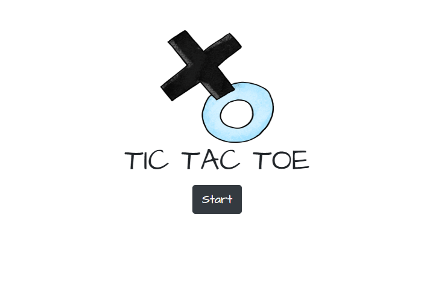
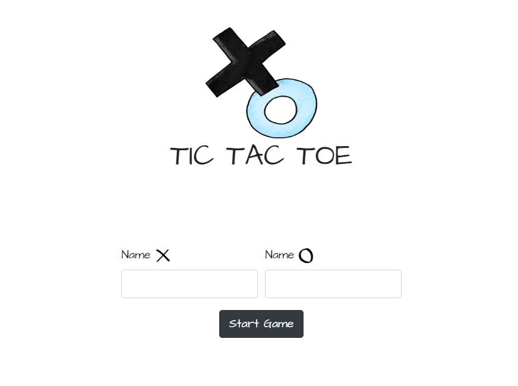
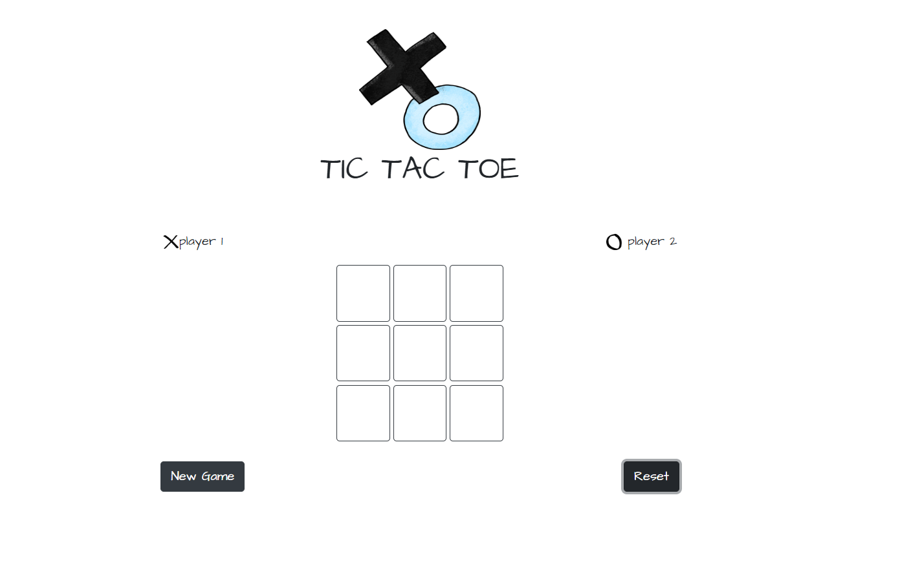
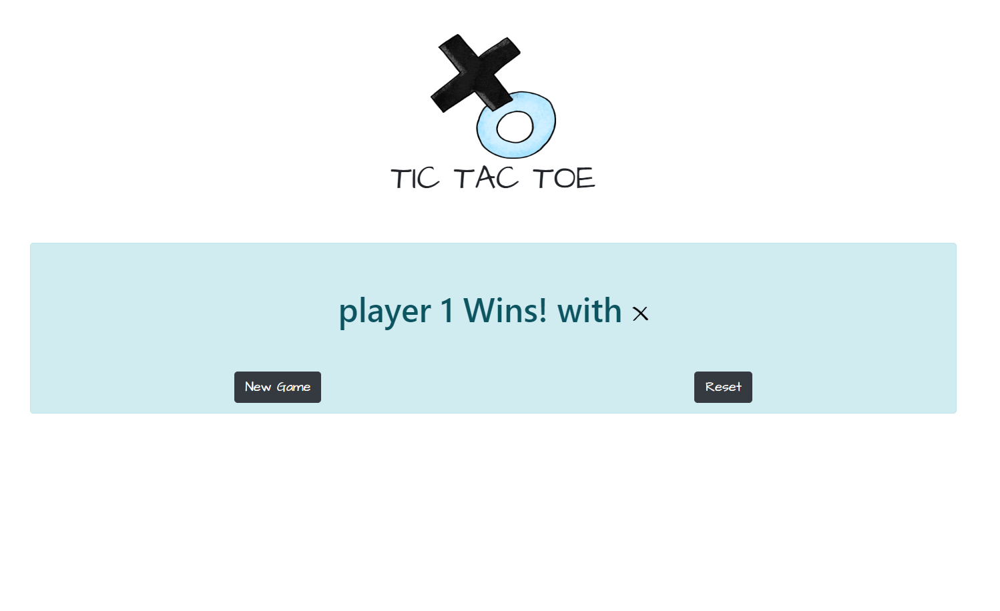

# Tic Tac Toe Game
## Requirements:

* Welcome page: with the Logo and the 'start' button which will disappears when the user clicks it.

* After clicking the 'start' button the program have to aks the players their names. The program has to validate the inputs in case they are empties

* After the inputs the program displays the board game with the players names and 2 button. 'Reset' and 'New Game':

'Reset button' cleans the board and remains the players names. 
'New Game button' starts a new game with new players

* finally in case there is a winner. The program must display the winner's name and the same two previous buttons.

**To resolve this Game you just need to know the basics of React and react Components. Remember to use conditional statements to render the components.**

The project has a **src** folder that contains a **component** 5 components:

* App.js -> main component which is rendered in the DOM
* Board.js -> here is where you will create the board 3x3
* Cell.js -> this is the component that represent a square of the board
* Header.js -> this is the component that displays the logo and start button at the beginning
* Info.js -> and this component is the one you will use to create the inputs for the players's name

those are the component we think are fundamentals for the development of the game, but feel free to add more components to make it your own style.

We also provided you with a set of images you need in the folder **images** and a group of css rules in the file **index.css**. We added Bootstrap CDN which means you can use bootstrap classes. You can create your own css style and images.

Create issues on the link below on the parent repo if you are stuck and want to talk about it. You can paste code, tag people and refer to other issues there. Please use it! It will be helpful for mentors and future students to see where common problems are. Link here: https://github.com/Code-the-Dream-School/Front-end-React-week-1/issues

Happy coding!!
